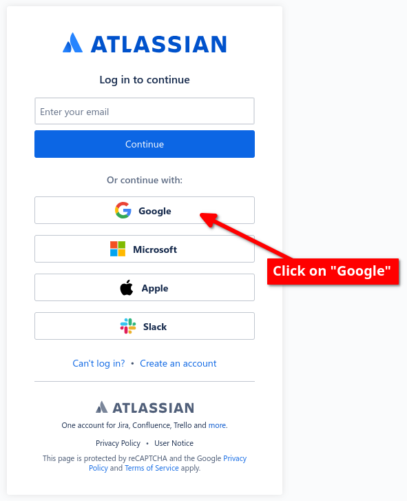
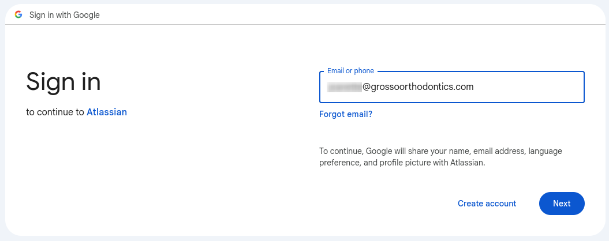

import { FontAwesomeIcon } from '@fortawesome/react-fontawesome'
import { faUserCircle, faChevronRight, faEllipsisV, faCog, faCheckCircle } from '@fortawesome/free-solid-svg-icons'
import { Link } from 'react-router-dom';

export const ithelpdesk = {
  pathname: 'https://id.atlassian.com/login?application=ondemand&continue=https%3A%2F%2Fcoretechonomy.atlassian.net%2Fservicedesk%2Fcustomer%2Fportal%2F3%2Fgroup%2F3%2Fcreate%2F1&tenant=https%3A%2F%2Fcoretechonomy.atlassian.net',
  state: { fromDashboard: true }
}

export const desktop = {
    borderRadius: "8px",
    padding: "20px",
    width: "320px",
    height: "350px",
    textAlign: "center",
    background: "#000033",
    border: "5px solid #333366"
}

## Login Instructions

:::tip
Remember to select `Continue with Google` when logging into the IT Help Desk.
:::

1. Click <Link to={ithelpdesk} target="_blank">here</Link> to head to the <Link to={ithelpdesk} target="_blank">IT Help Desk</Link> (or double-click the `IT Help Desk` icon on your desktop).

    

        <h3 style={{color: "white"}}>IT Support</h3> 
        <Link to={ithelpdesk} target="_blank"></Link>
           
        
Supported by Core Techonomy, LLC

        
Double-click the IT Help Desk icon to create a ticket. For immediate assistance, call 843-642-8322.

    

 

2. Click on `Continue with Google`

    

3. Select or input *your* **Grosso Orthodontics** email address and press `Next`

    

    :::caution
    You must use your `@grossoorthodontics.com` email address for this process — `@grossokids.com` will not work here.
    :::

## Conclusion

<FontAwesomeIcon icon={faCheckCircle} color="green" />&nbsp;That's all you need to do to access the new IT Help Desk. The key thing is to press the <code>Continue with Google</code> button and you will be on your way to success. Thank you for your attention and please let me know if you have any questions or run into any problems.